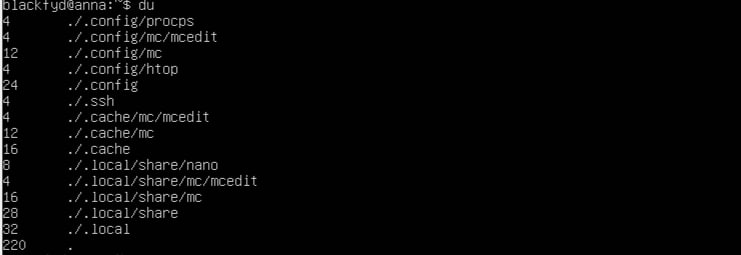

# Part 1. Установка ОС
== Задание ==
- Узнай версию Ubuntu, выполнив команду 
cat /etc/issue.

Результат с выводом команды.

# Part 2. Создание пользователя
== Задание ==
- Вставь скриншот вызова команды для создания пользователя

1) Создала нового пользователя с помощью команды: sudo adduser user_1
2) Добавила "user_1" в группу adm с помощью команды: sudo addgroup user1 adm 

.png)
Проверка, что user_1 в группе adm

- Новый пользователь должен быть в выводе команды:
cat /etc/passwd
.png)

Результат с выводом  команды: cat /etc/passwd

# Part 3. Настройка сети ОС
== Задание ==

- Задай название машины вида user-1.

1) Изменила название машины с помощью команды: sudo hostnamectl set-hostname user-1 
2) Проверила имя хоста с помощью команды: hostname 

- Установи временную зону, соответствующую твоему текущему местоположению

.png)
1) Узнаем текущую временную зону командой: timedatectl status 
2) Меняем текущую временную зону на мою с помощью комнады: sudo timedatectl set-timezone Europe/Moscow 
3) Проверила еще раз текущую временную зано с помощью команды: timedatectl status 

.png)

4. Вывела день и время с помощью команды: date
  
- Выведи названия сетевых интерфейсов с помощью консольной команды.
.png)

Узнаем название сетевых интерфейсов с помощью команды: ip link

   * В отчёте дай объяснение наличию интерфейса lo.
Интерфейс lo (loopback) представляет собой виртуальный интерфейс, который присутствует во всех операционных системах, поддерживающих TCP/IP, включая Ubuntu.Используется для взаимодействия процессов на самом компьютере без обращения к физической сети. Также обеспечивает стабильное взаимодействие приложений

- Используя консольную команду, получи ip адрес устройства, на котором ты работаешь, от DHCP сервера.
.png)
Получила ip с помощью команды: ip addr

   * В отчёте дай расшифровку DHCP.
DHCP (Dynamic Host Configuration Protocol) является сетевым протоколом , который автоматически(динамически)предоставляет хост Интернет-протокола (IP) с его IP-адресом и другими сетевыми параметрами устройств в сети. Используется для автоматической настройки параметров TCP/IP клиентских устройств в сети. 

- Определи и выведи на экран внешний ip-адрес шлюза (ip) и внутренний IP-адрес шлюза, он же ip-адрес по умолчанию (gw).
.png)
1) Командой: curl ifconfig.me/ip узнаем внешний ip-адрес шлюза

.png)

2) Комнадой: ip route show вывела внутренний ip-адрес шлюза

- Задай статичные (заданные вручную, а не полученные от DHCP сервера) настройки ip, gw, dns (используй публичный DNS серверы, например 1.1.1.1 или 8.8.8.8).
.png)
1) Открываю и заполняю файл с помощью команды: sudo nano /etc/netplan/00-installer-config.yaml
2) Применяю настройки командой: sudo netplan apply

- Перезагрузи виртуальную машину. Убедись, что статичные сетевые настройки (ip, gw, dns) соответствуют заданным в предыдущем пункте.
.png)
1) Перезагрузила виртуальную машину с помощью команды: sudo reboot
2) Проверяю, что статичные сетевые настройки соответствуют с помощью команды: ip route show

- Успешно пропингуй удаленные хосты 1.1.1.1 и ya.ru и вставь в отчёт скрин с выводом команды. В выводе команды должна быть фраза «0% packet loss».
.png)

Пропинговала удаленные хосты с помощью команды: ping -c 4 1.1.1.1 и команды: ping -c 4 ya.ru 

# Part 4. Обновление ОС
== Задание ==

- Обнови системные пакеты до последней на момент выполнения задания версии.

- После обновления системных пакетов, если ввести команду обновления повторно, должно появиться сообщение, что обновления отсутствуют

1) Обновляю список доступных пакетов с помощью команды: sudo apt update 
2) Обновляю пакеты с  помощью команды: sudo apt upgrade 

.png)
3) Проверяю после обновления состояние командой:sudo apt update.
Видим по выводу программы,что больше обновлений нет

# Part 5. Использование команды sudo
== Задание ==
- Разреши пользователю, созданному в Part 2,выполнять команду sudo

1) Добавила пользователя в группу sudo с помощью команды: sudo usermod -aG sudo user_1 
2) Проверила добавился ли пользователь в группу sudo с помощью команды: groups user_1 
   * В отчёте объясни истинное назначение команды sudo (про то, что это слово - «волшебное», писать не стоит);
Команда sudo(substitute user and do) позволяет выполнять команды от имени суперпользователя (root), если идентификатор или имя этого пользователя не указаны, иначе от имени любого пользователя. В Ubuntu по умолчанию отсутствует активная учетная запись суперпользователя, и вместо этого используется первый созданный пользователь с правами администрирования. Он может использовать команду  для выполнения команд, требующих повышенных привилегий.

- Поменяй hostname ОС от имени пользователя, созданного в пункте Part 2 (используя sudo);
.png)
1) Поменяла hostname с помощью команды: sudo hostnamectl set-hostname anna 
2) Проверила имя хоста с помощью команды: hostname

# Part 6. Установка и настройка службы времени
== Задание ==
- Выведи время часового пояса, в котором ты сейчас находишься.
- Вывод следующей команды должен содержать NTPSynchronized=yes: 
timedatectl show

1) Настроила службу автоматической синхронизации времени с помощью команды: sudo systemctl enable systemd-timesyncd 
2) Включила службу автоматической синхронизации времени с помощью команды: sudo timedatectl set-ntp true 
3) Проверила статус службы с помощью команды: sudo systemctl status systemd-timesyncd 
 
.png)

4) Посмотрела время с помощью команды: timedatectl show

# Part 7. Установка и использование текстовых редакторов
== Задание ==
- Установи текстовые редакторы VIM (+ любые два по желанию NANO, MCEDIT, JOE и т.д.)
- Используя каждый из трех выбранных редакторов, создай файл test_X.txt, где X -- название редактора, в котором создан файл. Напиши в нём свой никнейм, закрой файл с сохранением изменений.
1) Устанавливаю текстовый редактор VIM с помощью команды: sudo apt install vim
2) Создаю файл: vim test_vim.txt

Сохраняю изменения и выхожу из редактора VIM с помощью набора клавиш: "esc :wq"

3) Устанавливаю текстовый редактор NANO с помощью команды: sudo apt install nano
4) Создаю файл: nano test_nano.txt
.png)

Сохраняю изменения в редакторе NANO с помощью комбинации: "^XY"

5) Устанавливаю текстовый редактор MCEDIT с помощью команды: sudo apt install mcedit
6) Создаю файл: mcedit test_mcedit.txt
.png)

Сохраняю изменения в редакторе MCEDIT: "esc yes"

.png)

Проверяю, что все файлы существуют с помощью команды: ls

- Используя каждый из трех выбранных редакторов, открой файл на редактирование, отредактируй файл, заменив никнейм на строку «21 School 21», закрой файл без сохранения изменений.

.png)

Чтобы выйти без сохранения изменений из редактора VIM, изпользую набор клавиш: "esc :q!"

.png)

Чтобы выйти без сохранения изменений из редактора NANO, изпользую комбинацию: "^xn"

.png)

Чтобы выйти без сохранения изменений из редактора  MCEDIT, использую: "esc/F10 no"

.png)

Проверяю, что  содержание всех текстовых файлов  не изменилось, с помощью команды: cat test_vim.txt test_nano.txt test_mcedit.txt

- Используя каждый из трех выбранных редакторов, отредактируй файл ещё раз (по аналогии с предыдущим пунктом), а затем освой функции поиска по содержимому файла (слово) и замены слова на любое другое.

.png)
VIM поиск "/blackfyd"

.png)
VIM замена ":%s/blackfyd/21 School 21"

.png)
NANO поиск с помощью комбинации: "ctrl+w"

.png)
NANO замена с помощью комбинации: "ctrl+\"

.png)
MCEDIT поиск с помощью клавиши: "F7"

.png)
MCEDIT замена с помощью клавиши: "F4"

.png)

Проверка, все ли правильно заменила, с помощью команды: cat test_vim.txt test_nano.txt test_mcedit.txt

# Part 8. Установка и базовая настройка сервиса SSHD
== Задание ==
- Установить службу SSHd

Установила службу SSHd с помощью команды: sudo apt install ssh
 
- Добавить автостарт службы при загрузке системы
.png)

Добавила автостарт ssh с помощью команды: sudo systemctl enable ssh

- Перенастроить службу SSHd на порт 2022

.png)
1) С помощью команды sudo nano /etc/ssh/sshd_config открыла файл конфигурации службы SSHd
2) Изменила "Part 22" на "Part 2022"

- Используя команду ps, показать наличие процесса sshd. Для этого к команде нужно подобрать ключи
.png)

Посмотрела наличие процесса sshd с помощью команды: ps -axfv | grep sshd, где -axfv ключи

- -a: отображает информацию о всех процессах, зкроме лидеров сеансов и процессов, не связанных с терминалом.
- -x: заставляет ps отображать информацию о процессах, которые не имеют контрольного терминала.
- -f: отображает полноформатный список о процессах.
- -v: отображает информацию о версии,информацию о памяти, используемой процессом, и статусе процесса.

- Перезагрузить систему.
- В отчёте опишите, что сделали для выполнения всех пяти пунктов (можно как текстом, так и скриншотами)
.png)
Вывод команды nestat -tan

- В отчёте объяснить значение ключей -tan, значение каждого столбца вывода, значение 0.0.0.0.
- -a показывает состояние всех сокетов
- -n показывает ip адрес, а не сетевое имя
- -t показывает только tcp соединения 

Значение столбцов: 
- Proto - это протокол, который используется данным сокетом для связи с другими узлами в сети
- Recv-Q - это количество байтов, которые еще не были прочитаны пользовательской программой, подключенной к данному сокету и ожидают обработки
- Local Address - локальный адрес (имя локального хоста) и номер порта сокета
- Foreigh Address - удаленный адрес (имя удаленного хоста) и номер порта сокета, с которым установлено соединение
- State - то текущее состояние сокета, указывающее на его активность и доступность для обмена данными
- 0.0.0.0 в этом контексте означает ", что сокет прослушивает все IP-адреса на локальной машине

# Part 9. Установка и использование утилит top, htop
== Задание ==
-Установи и запусти утилиты top и htop.
1) Устанавила утилиту top с помощью команды: sudo apt install procps

Запустила утилиту top
.png)
Запустила утилиту htop

  * По выводу команды top определи и напиши в отчёте:
- uptime 23:49:04
- количество авторизованных пользователей 1
- общую загрузку системы 0.00, 0.04, 0.01
- общее количество процессов 106 total
- загрузку cpu 0.0 us, 0.3 sy, 0.0 ni, 0.0 si, 0.0 st
- загрузку памяти 166.1 used
- pid процесса занимающего больше всего памяти 1069
- pid процесса, занимающего больше всего процессорного времени 1069

-В отчёт вставь скрин с выводом команды htop:
отсортированному по PID, PERCENT_CPU, PERCENT_MEM, TIME
.png)
Сортировка PID
.png)
Сортировка PERCENT_CPU
.png)
Сортировка PERCENT_MEM
.png)
Сортировка TIME

- отфильтрованному для процесса sshd

.png)

- с процессом syslog, найденным, используя поиск

.png)

- с добавленным выводом hostname, clock и uptime

.png)

# Part 10. Использование утилиты fdisk
== Задание ==
- Запусти команду fdisk -l

Вывод команды fdisk -l

- В отчёте напиши название жесткого диска, его размер и количество секторов, а также размер swap.
  1) /dev/sda
  2) 26843545600 bytes, 52428800 sectors
.png)
  3) 2G (swapon --show)

# Part 11. Использование утилиты df
== Задание ==
- Запусти команду df

Вывод команды df / (для корневого раздела)
 - В отчёте напиши для корневого раздела (/):
  размер раздела 11758760
  размер занятого пространства 4847404
  размер свободного пространства 6292248
  процент использования 44%
 
 - Определи и напиши в отчёт единицу измерения в выводе
 Вообще в выводе df используются килобайты, но если добавить флаг -h можно увидеть единицы измерения
- Запусти команду df -Th.

.png)
Вывод команды df -Th /
- В отчёте напиши для корневого раздела (/):
 размер раздела 12G
 размер занятого пространства 4,7G
 размер свободного пространства 6,1G
 процент использования 44%

 - Определи и напиши в отчёт тип файловой системы для раздела: ext4

# Part 12. Использование утилиты du
== Задание ==
- Запусти команду du

- Выведи размер папок /home, /var, /var/log (в байтах, в человекочитаемом виде)
.png)

Вывела размер папок с помощью команды: du -sb (где -b в байтах -s показывает только суммарные данные)

- Выведи размер всего содержимого в /var/log (не общее, а каждого вложенного элемента, используя *)
.png)
Вывела размер с помощью команды: du -sb /var/log/*

# Part 13. Установка и использование утилиты ncdu
== Задание ==
- Установи утилиту ncdu

Установила утилиту с помощью команды: sudo apt install ncdu

- Выведи размер папок /home, /var, /var/log

.png)
Вывод размера папки /home

.png)
Вывод размера папки /var

.png)
Вывод размера папки /var/log

# Part 14. Работа с системными журналами
== Задание ==
- Открой для просмотра:
1. /var/log/dmesg

Открыла с помощью команды: nano -v /var/log/dmesg
2. /var/log/syslog

.png)

Открыла с помощью команды: nano -v /var/log/syslog
3. /var/log/auth.log

.png)

Открыла с помощью команды: nano -v /var/log/auth.log

- Напиши в отчёте время последней успешной авторизации: Jun 19 01:06:33
.png)
- Имя пользователя: blackfyd
- Метод входа в систему: TTY: tty1 
- Перезапусти службу SSHd
1) Перезапустила службу sshd с помощью команды: sudo systemctl restart ssh 
2) проверила статус с помощью команды: sudo systemctl status ssh проверила статус
.png)
Проверка после перезапуска

# Part 15. Использование планировщика заданий CRON
== Задание ==
- Используя планировщик заданий, запусти команду uptime через каждые 2 минуты
- Используя команду crontab -e вводи параметр */2 * * * * uptime
- Найди в системных журналах строчки (минимум две в заданном временном диапазоне) о выполнении;

Добавила uptime каждые 2 минуты в CRON

- Выведи на экран список текущих заданий для CRON; 

.png)
Вывела список задач CRON с помощью команды: crontab -l 

- Удали все задания из планировщика заданий.
- В отчёт вставь скрин со списком текущих заданий для CRON

.png)
1) Удалила с помощью команды: crontab -r 
2) После проверила с помощью команды: crontab -l 

